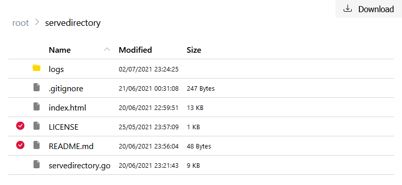

# servedirectory
servedirectory is a one file command line app, with no prerequisite, that serve a directory using HTTP.


## Usage warning
servedirectory is **not** intended to be used on a production server, nor over Internet, as it may lead to information disclosure if not used with care.

## Features
- HTTP(S)
- Basic authentication
- Choose port: 80, 443, or any one over 1024
- Logging
- Sort the list by name, modified date or size
- Download multiple files/folders as a zip

## Command line arguments
```
Usage:
  -c string
  -credentials string
        Add Basic Authentication (credentials should be in the username:password format)

  -d string
  -directory string
        Directory to serve
        By default, the current directory is used

  -l string
  -logfile string
        Optional log file

  -p int
  -port int
        Bind to a specific port
        By default, a random port is used

  -s
  -secured
        Create a secured (HTTPS) server
```

## Secured server
The certificate must be named `cert.pem`. If the certificate is signed by a certificate authority, the cert.pem file should be the concatenation of the server's certificate, any intermediates, and the CA's certificate.
The private key must be named `key.pem`.
Both files must be located in the same folder as servedirectory.

## License

[MIT](https://github.com/JulienChebance/servedirectory/blob/main/LICENSE)